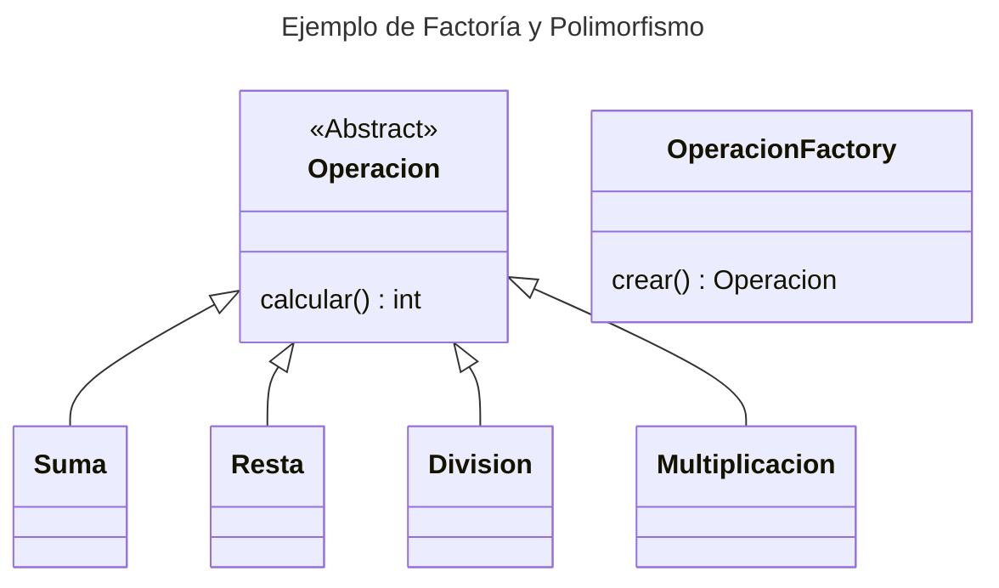

# Ejercicio de Calculadora

El servidor acepta peticiones del cliente compuestas por: NUM, OPERADOR,NUMERO y éste realiza la petición.

Todo el ejercicio se ha implementado utilizando el envío de String en codificación UTF-8, para ello todo envío se realiza en dos pasos:
- Se envía el tamaño de lo que se va a enviar a continuación
- Se envía el contenido (del tamaño anterior) en bytes.

Se ha agregado una traza en el servidor para ver el proceso del servidor.

## Junit

Este proyecto incorpora el uso de junit para las pruebas de la lógica y del servidor